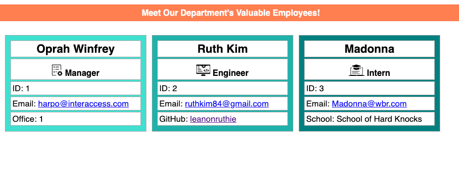

# OOP-Team-Roster

## User Story
```md
AS A department manager
I WANT to create a team roster with each member's basic information in a simple html format
SO THAT i can contact them using either GitHub or email instead of calling their cell phones
```

## Acceptance Criteria
```md
GIVEN a correct directory and node.js
WHEN I type in node index.js
THEN basic qustions about my employees are prompted
WHEN my employee is a manager
THEN I must correctly answer his/her/their name, ID, email and office # to move onto the next option to support him/her/them with either an engineer or an intern
WHEN I choose an engineer
THEN I must provide engineer's GitHub username in addition to the aforementioned basic info
WHEN I choose an intern
THEN I must provide intern's school name in addition to the aforementioned basic info
WHEN I finish answering my questions
THEN a simple team roster of my manager, engineer(s) and interns(s) is created in simple html format
WHEN I click on respective email address links in the webpage
THEN I have a "new compose message" pop-up with their email addresses as recipients
WHEN I click on their GitHub links in the webpage
THEN I am able to see their GitHub profile in a new tab
```

## Screenshot


## Deliverables
[GitHub Repository](https://github.com/leanonruthie/OOP-Team-Roster.git)

## Video
This can now be directly inserted in GitHub as seen below:

https://user-images.githubusercontent.com/107362875/187519727-884d8f15-3aec-4582-91b3-c05e65cf3d75.mp4

